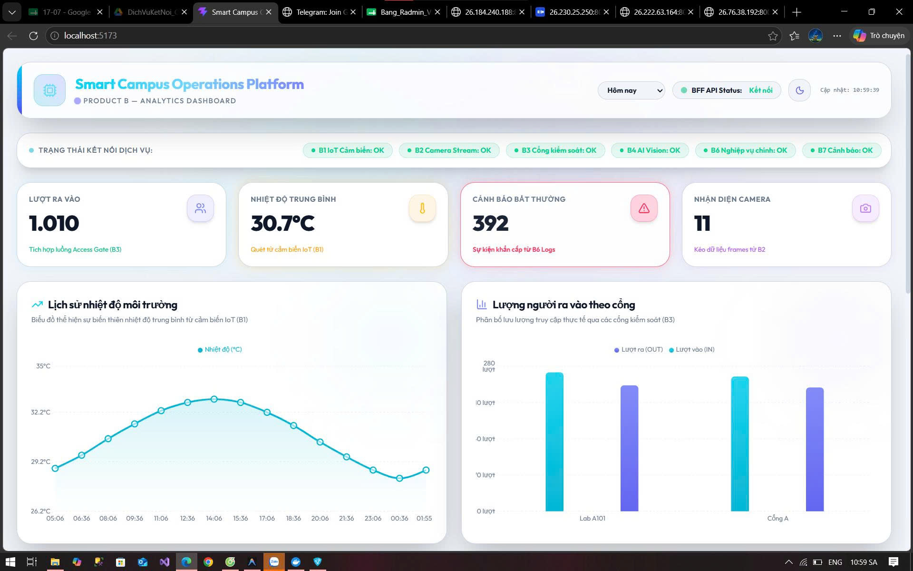
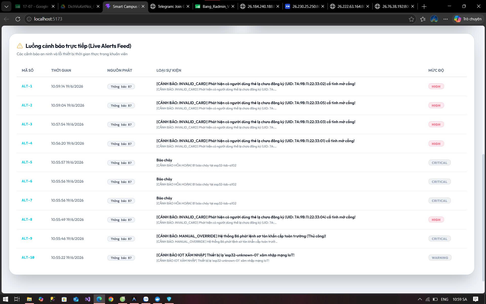

Markdown
# 🏢 Smart Campus Operations Platform - Product B (Analytics Service - Team B5)

## 📌 1. Giới thiệu Tổng quan (Service Overview)
Dịch vụ **Analytics Service (B5)** đóng vai trò là bộ não xử lý trung tâm, chịu trách nhiệm thu thập, phân tích dữ liệu thời gian thực (Real-time) và giám sát trạng thái vận hành của toàn bộ hệ thống Smart Campus. Dịch vụ cung cấp giao diện Dashboard Cyber-Darkmode giúp người quản trị theo dõi toàn diện luồng ra vào, biến động nhiệt độ, và các cảnh báo an ninh.

---

## 🗺️ 2. Kiến trúc & Ranh giới Dịch vụ (Service Boundary Diagram)
> *Đạt mức điểm: Tốt - Sơ đồ rõ ràng, xác định đủ Input/Output, Upstream/Downstream, và Data Owner (`image_3aff9e.jpg`).*

*   **Tài liệu chi tiết:** `📁 checklists/service_boundary.md`
*   **Data Owner:** Nhóm B5 chịu trách nhiệm lưu trữ và sở hữu dữ liệu tổng hợp nhật ký (Logs Analytics Data).

### Luồng Giao tiếp Hệ thống (System Data Flow)
```text
┌─────────────────┐             (MQTT QoS 1)             ┌──────────────────────┐
│  B1 - IoT Node  │ ───────────────────────────────────> │                      │
└─────────────────┘                                      │                      │
┌─────────────────┐       (HTTP POST Webhook - Real)     │                      │
│   B3 - Access   │ ───────────────────────────────────> │                      │
└─────────────────┘                                      │   B5 - ANALYTICS     │
┌─────────────────┐       (HTTP POST Webhook - Real)     │      SERVICE         │
│ B2 & B4 - Vision│ ───────────────────────────────────> │   (FastAPI + BFF)    │
└─────────────────┘                                      │                      │
┌─────────────────┐       (HTTP GET Pull Task - 5s)      │                      │
│ B7 - Notification│ <────────────────────────────────── │                      │
└─────────────────┘                                      └──────────────────────┘
                                                                    │
                                                                    ▼
                                                         ┌──────────────────────┐
                                                         │  ReactJS Dashboard   │
                                                         │ (Polling 5s + Drill) │
                                                         └──────────────────────┘
```

📜 3. Hợp đồng API Spec (OpenAPI Contract & Endpoints)
Đạt mức điểm: Tốt - Có đầy đủ Schema, Status Code, Example, Error Model, và Authentication (image_3aff9e.jpg).

Toàn bộ đặc tả API được thiết kế chuẩn chỉnh theo mô hình Design-First, lưu trữ tập trung tại thư mục hợp đồng:

API Central Contract: 📄 contracts/b5_analytics.openapi.yaml

Endpoint Catalog: Xem chi tiết danh sách URL và các mã phản hồi lỗi 422, 400, 500 tại file hợp đồng OpenAPI hoặc truy cập UI Swagger khi chạy hệ thống.

⚙️ 4. Hướng dẫn Triển khai & Vận hành (Deployment & Operation Guide)
Đạt mức điểm: Tốt - Khởi chạy trực tiếp từ repo sạch, cấu hình qua môi trường và có cơ chế Healthcheck an toàn (image_3aff9e.jpg).

Hệ thống hỗ trợ đóng gói cô lập hoàn toàn qua Docker. Thực hiện theo các bước sau để thiết lập từ một máy tính mới:

Bước 1: Chuẩn bị Môi trường (Prerequisites)
Cài đặt sẵn Docker & Docker Compose trên máy tính.

Bật Radmin VPN và kết nối vào mạng chung của dự án để thông luồng IP.

Bước 2: Cấu hình Biến môi trường
Copy file cấu hình mẫu và điền chính xác địa chỉ IP Radmin của các nhóm đối tác:

Bash
cp .env.example .env
Mở file .env ra và cấu hình các endpoint đích:

Đoạn mã
POSTGRES_DB=analytics_db
B1_IOT_HEALTH_URL=[http://26.190.131.131:8000/health](http://26.190.131.131:8000/health)
B3_ACCESS_HEALTH_URL=[http://26.222.63.164:8000/health](http://26.222.63.164:8000/health)
B7_NOTIFY_LOGS_URL=[http://26.177.175.21:8085/api/v1/alerts/logs](http://26.177.175.21:8085/api/v1/alerts/logs)
Bước 3: Khởi chạy Toàn bộ Hệ thống (One-Command Start)
Gõ lệnh duy nhất sau tại thư mục gốc để Docker tự động tải, cấu hình cơ sở dữ liệu TimescaleDB, chạy background worker và kích hoạt Web Server:

Bash
docker compose up -d --build
Bước 4: Kiểm tra Sức khỏe Hệ thống (Healthcheck Verification)
Backend API (Swagger UI): Truy cập http://localhost:8000/docs để kiểm tra các cổng kết nối.

Frontend Dashboard: Truy cập http://localhost:3000 để xem giao diện Real-time Dashboard và tính năng Drill-down Slide-over panel.

🧪 5. Kịch bản Kiểm thử & Tích hợp (Testing & Integration Report)
Đạt mức điểm: Tốt - Bao gồm Happy Path, Negative Path, Bắt lỗi Boundary và Báo cáo kiểm thử tự động Newman (image_3aff9e.jpg).

Nhóm sử dụng Postman & Newman để tự động hóa quy trình kiểm thử tích hợp liên dịch vụ:

Postman Collection: Lưu tại 📁 postman/Smart_Campus_B5_Collection.json

Test Report: Báo cáo kiểm thử tự động xuất ra file 📁 postman/newman_report.html.

Chạy kiểm thử thủ công qua cURL (Happy Path & Negative Verification):
1. Giả lập luồng quẹt thẻ từ B3 (Đúng chuẩn):

Bash
curl -X POST http://localhost:8000/api/v1/ingest/access \
  -H "Content-Type: application/json" \
  -d '{"event_id": "acc-101", "gate_id": "GATE-A", "direction": "IN", "access_granted": true, "person_type": "student", "timestamp": "2026-06-19T20:00:00Z"}'
2. Giả lập lỗi dữ liệu thiếu trường bắt buộc (Negative Path - Trả về 422 lỗi):

Bash
curl -X POST http://localhost:8000/api/v1/ingest/access \
  -H "Content-Type: application/json" \
  -d '{"event_id": "acc-102"}' # Thiếu trường sẽ bị hệ thống chặn validation trả về HTTP 422
📦 6. Danh mục Minh chứng Đính kèm (Demo Pack Deliverables)
Đáp ứng đầy đủ 100% các thành phần bắt buộc của Demo Pack .
<p align="center">
  
</p>
<p align="center">
  
</p>
Mã nguồn ứng dụng: Nằm trong thư mục 📁 src/ (Backend) và 📁 frontend/ (Giao diện React).

Minh chứng Log hệ thống: Xem chi tiết file log xuất từ Docker 📁 checklists/logs_evidence.txt để chứng minh hệ thống kết nối thành công và lưu DB không bị Null.


---
